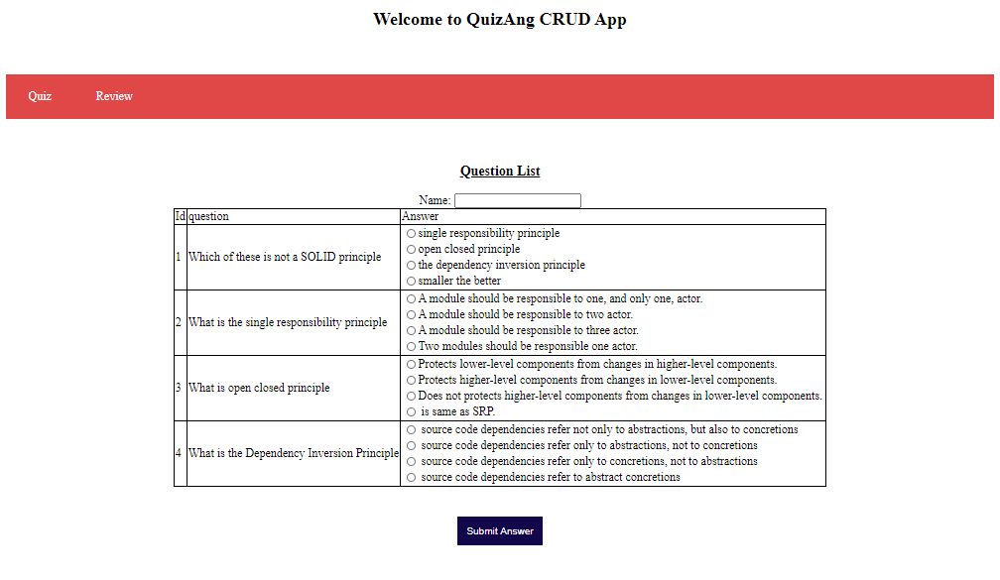
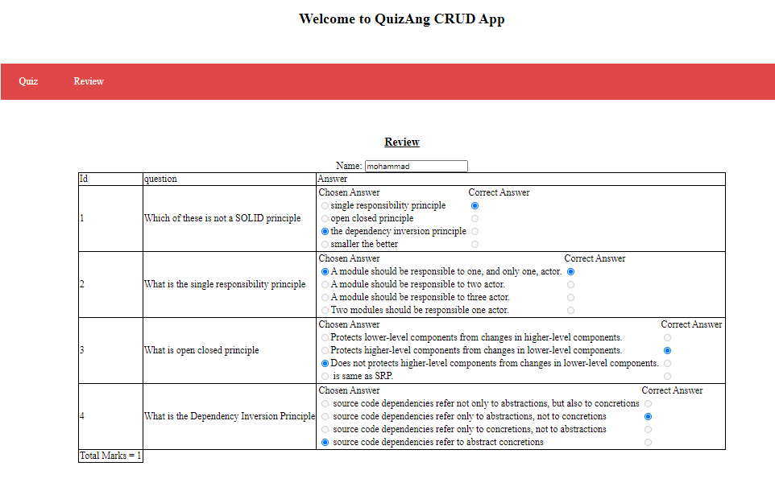
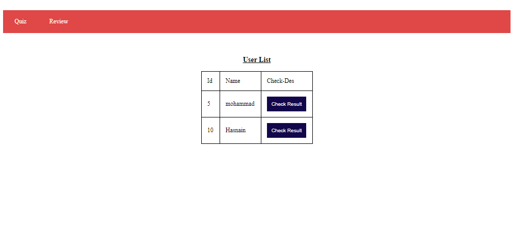
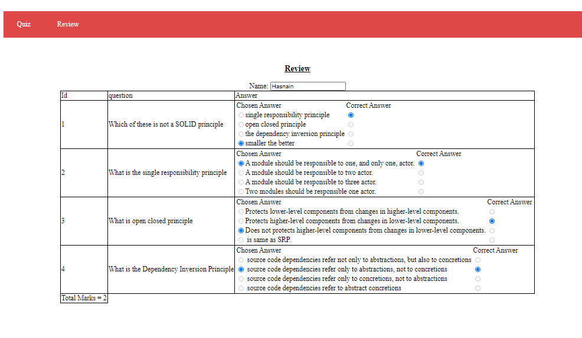

# **Online Test Application**

**Introduction**

The application helps conduct online quiz. It uses H2 database to store data. Command Runner is used to insert questions and their corresponding answers. The backend is made using Spring Boot and frontend is made using Angular.

**The Table Entity Classes used are:**

| Entity Name| Use |
| --- | --- |
| The Question class: | Stores the question Text. |
| The Answer Option Class | Stores the option text. 4 answeroption is mapped to one question. Thus making a many to one relationship. It stores the question\_id as a foreign key |
| The User Class | Stores the user name and User id |
| The Quiz Response Class | Stores the response of the user. It consists of user\_id(foreign key referencing user (Many to one)), question\_id(foreign key referencing Question(Many to one)) and AnswerOption\_id(foreign key referencing Answer Option(Many to one)) |

The database was designed to minimize duplication of data and also minimize occurrence of nulls.

**Spring Boot App**

The Dao classes were used to handle data manipulations one per Entity. The controllers handle the requests to Get All Questions, Store User Response, Get responses by a specific user id. Get all users. In this way all quiz attempts are stored. Any old attempt can be viewed again.

**Angular Frontend**

**The Quiz component** uses radio buttons to display the Answers. The questions are displayed besides them.

**The Result component** is directly called when the quiz is submitted and it shows the responses and the current answers side by side. Total Marks are displayed at the bottom

All the attempts can be seen clicking on the **Review** button

The **check Result button** loads the responses of a specific users and shows on the Result screen

The textboxes and Radio buttons on the Result screen is disabled to avoid confusion

**How to run the project:**

1. Clone the repository
2. Cd to the repository root
3. Open the Spring boot app named QuizApi (reporoot/api/QuizApi) in the Spring Tool Kit.
4. Do Maven Update
5. Run as spring boot App.
6. Open the QuizAng (reporoot/ frontend/QuizAng) Angular project in Visual Studio Code(Optional)
7. Cd to reporoot/ frontend/QuizAng
8. Run command &quot;ng serve --o&quot; to launch the angular project in the default browser([http://localhost:4200/](http://localhost:4200/))
9. You can now use the Application
